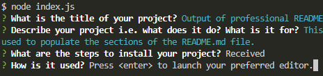
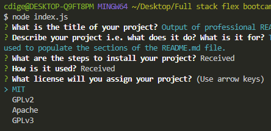
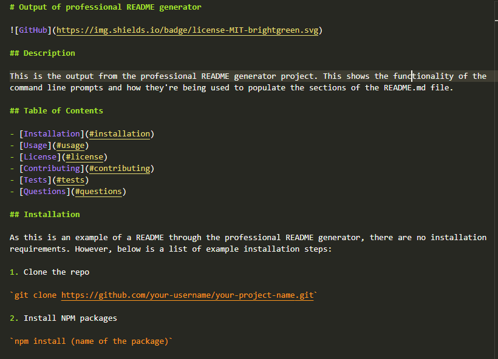
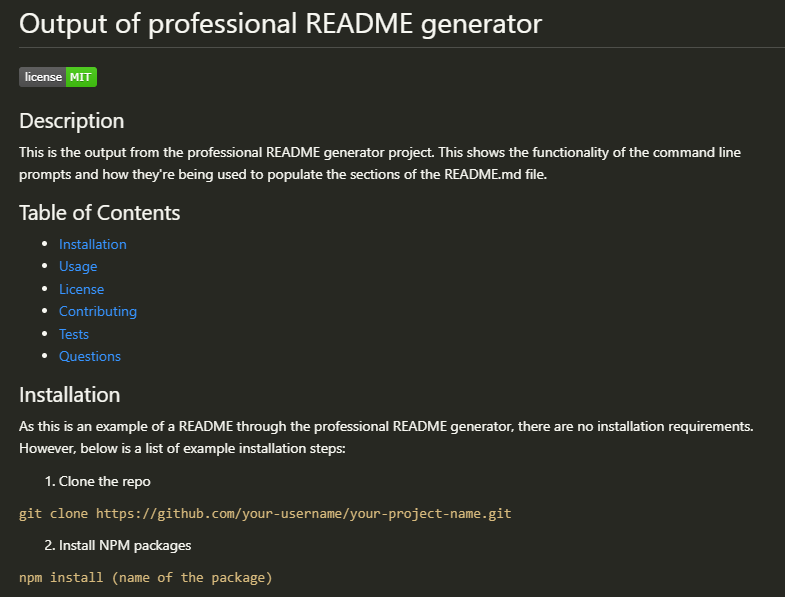

# Professional README generator


## Description

This project generates README.md files through using Node.js. When a user invokes the command `node index.js` in the command line, the user is provided a number of prompts to answer, which are a mixture of input, list and editor prompts.

Once the final prompt is answered, the user is provided a message that it has been a success and a README.md file is generated for that project.

## Table of contents
- [User Story](#user-story)
- [Acceptance criteria](#acceptance-criteria)
- [Technologies used/built with](#technologies-usedbuilt-with)
- [Installation](#installation)
- [Usage](#usage)
- [Credits](#credits)
- [License](#license)

## User story

```
AS A developer
I WANT a README generator
SO THAT I can quickly create a professional README for a new project
```

## Acceptance criteria

```
GIVEN a command-line application that accepts user input
WHEN I am prompted for information about my application repository
THEN a high-quality, professional README.md is generated with the title of my project and sections entitled Description, Table of Contents, Installation, Usage, License, Contributing, Tests, and Questions
WHEN I enter my project title
THEN this is displayed as the title of the README
WHEN I enter a description, installation instructions, usage information, contribution guidelines, and test instructions
THEN this information is added to the sections of the README entitled Description, Installation, Usage, Contributing, and Tests
WHEN I choose a license for my application from a list of options
THEN a badge for that license is added near the top of the README and a notice is added to the section of the README entitled License that explains which license the application is covered under
WHEN I enter my GitHub username
THEN this is added to the section of the README entitled Questions, with a link to my GitHub profile
WHEN I enter my email address
THEN this is added to the section of the README entitled Questions, with instructions on how to reach me with additional questions
WHEN I click on the links in the Table of Contents
THEN I am taken to the corresponding section of the README
```

## Technologies used/built with

This project used the following technologies to build it:
- Node.js
- JavaScript
- Inquirer NPM package
- `fs` for file creation

## Installation

1. Clone the repo (HTTPS: `git clone https://github.com/CharDige/Professional-readme-generator.git` or SSH: `git clone git@github.com:CharDige/Professional-readme-generator.git`)

2. Install inquirer NPM package (`npm install inquirer`)

## Usage

### Video

To view how this professional README generator works and how it can be used, you can watch [this walkthrough video](https://drive.google.com/file/d/1rA-6PknbEckufH45WlOnWlcWsBWhcApv/view?usp=sharing).

### Screenshots

After the installation process has been undertaken, initiate the prompts by beginning with entering `node index.js` into the command line


You will then begin to be prompted by questions for you to answer. The first two questions are input prompts, so you can type in your responses to those questions into the command line and then hit ENTER to submit your response to the prompt.


Some of the prompts will ask you to hit ENTER to launch the preferred text editor, such as Notepad for Windows.


Once you hit ENTER, a temporary text editor file will open. You will then be able to provide your answer to the prompt while also including all the markdown styling you wish to include.


Once you've finished with your text editor, you **must** save the temp file.


Then, close the text editor. You will see that your answers have been received as the command line will show the word `Received` in the command line next to the question you've just answered.



You will reach a question asking for a license for your project. This list currently shows four options. Use the arrow keys on your keyboard to choose your license and hit ENTER to select it.



Once you've answered all the prompts, a README.md file will be generated with all your answers filling the relevant sections.





And there you have it, a generated professional README for your project! And, once it has been generated, you will be able to edit your README.md file as you would any file in case you have missed something or you want to add further information to your README--like screenshots!

## Credits

Here's a list of resources I'd like to credit that really helped with the creation of this application:

- [Shields.io](https://shields.io/)
- [Professional README Guide - The Full-Stack Blog](https://coding-boot-camp.github.io/full-stack/github/professional-readme-guide)
- [Choose a license](https://choosealicense.com/)
- [Inquirer.js - npm.js](https://www.npmjs.com/package//inquirer)

## License
[MIT License - Copyright (C) 2022 Charlotte Dige](./LICENSE)